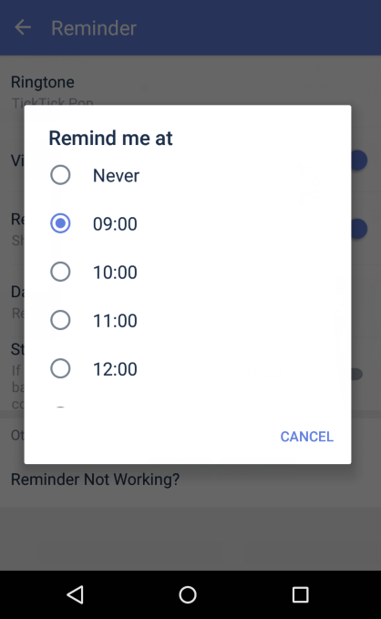

### How to set "Daily Alert"?

Daily Alert provides you with a daily summary of all the tasks you have scheduled for today. You choose when this alert occurs.

1. Open TickTick on your Android device, then either swipe to the right or tap the hamburger button in the upper-left corner.

2. Tap the gear-shaped icon in the upper-right corner.

3. Tap "Reminder", then tap "Daily Alert" to choose a time for the alert to occur.

