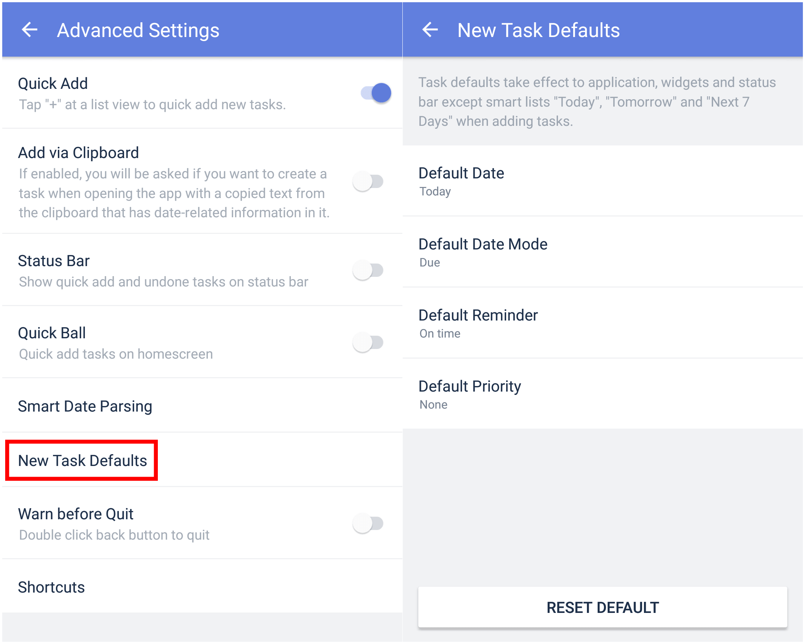

### How to set default attributes of a new task ?

If you want to set a specific due date, priority level, and/or reminder every time you create a new task, you can set "New Task Defaults" in TickTick. Here's how:

1. Open TickTick on your Android device, then go to the Settings tab page.

2. Tap "Advanced Settings", then tap "New Task Defaults".

3. Set the default values such as priority, due date, and reminder time for new tasks.

