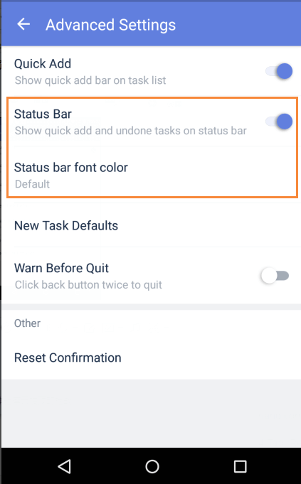

### How to use Status Bar?

The TickTick Status Bar appears in the standard pull-down screen of your Android phone. A message will appear showing today's tasks, and TickTick will open if you click on the message.

### How to enable Status Bar?

1. Open TickTick on your Android device, then either swipe to the right or tap the hamburger button in the upper-left corner.

2. Tap the gear-shaped icon in the upper-right corner.

3. Tap "Advanced Settings", then tap "Status Bar" to activate it.

You can also change the font color for your Status Bar entries. There is an option directly below the "Status Bar" menu item.

### How to make notifications stay on your Status Bar?

If you enable the "Stick on Status Bar" feature, notifications will stay on the status bar until you view, complete,or snooze the task.

1. Open TickTick on your Android device, then either swipe to the right or tap the hamburger button in the upper-left corner.

2. Tap the gear-shaped icon in the upper-right corner.

3.Tap "Reminder", then tap "Stick on Status Bar".

