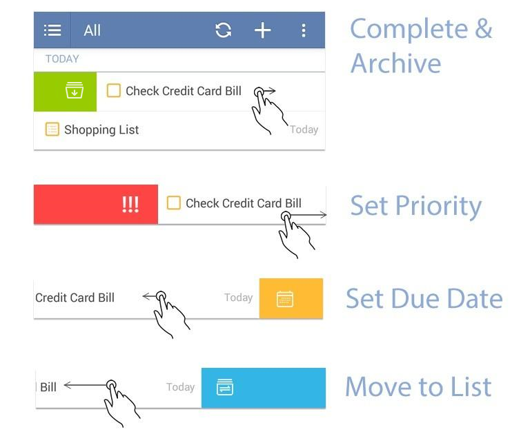

###How to swipe tasks for quick actions?
There are four different colors of menu for frequently used actions and you can slide right or left to choose menu. Green means complete & archive a task, red means set priority; yellow means set due date while blue means move to list.

