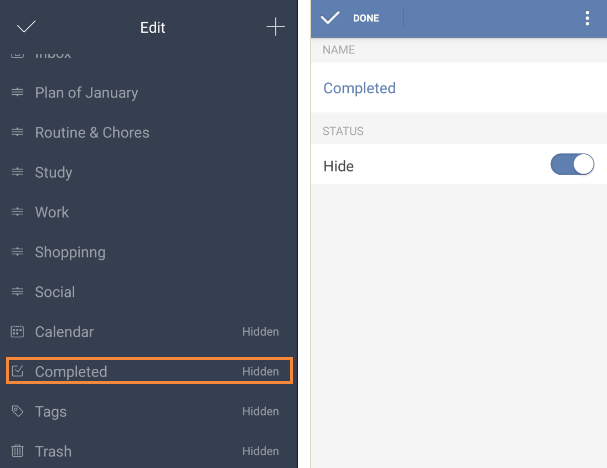

### How many predefined lists are there in TickTick?
There are 8 predefined lists in TickTick. They are “All, Today, Next 7 Days, Inbox, Calendar, Completed, Tags, and Trash”. Some of them are hidden as default, and you can make them visible in the task list.

 

**-Take “Completed” list as an example:**

1.Slide the screen to the right from margin or click the bulleted list icon on the top left of the toolbar.

2.Click “Edit List” at the bottom of the page.

3.Choose “Completed”.

4.Close the “Hide” button to make it visible.

Except “All” and “Inbox”, any other lists can be hidden in task list.

