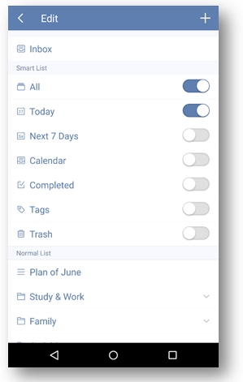

### How many predefined lists are there in TickTick?
There are 9 predefined lists in TickTick: All, Today, Next 7 Days, Inbox, Calendar, Completed, Tags, Assigned to me and Trash”. Some of them are hidden by default, but you can make them all visible in the task list.

 

**-Take “Completed” list as an example:**

1.Open TickTick on your android device.

2.Slide the screen to the right.

3.Tap “Edit List” at the bottom.

4.Enable “Completed” in the next page.

Except “Inbox”, any other lists can be hidden from task list.

