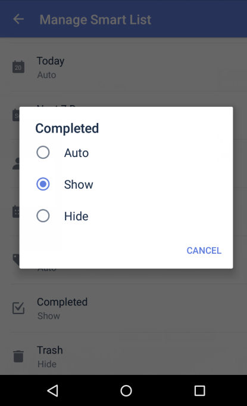

### How to show or hide Smart Lists in TickTick?
Ticktick comes with nine predefined lists: Inbox, All, Today, Next 7 Days, Assigned to me, Calendar, Completed, Tags, and Trash. Some are hidden by default but you can make them visible. Here's how:
 

**For example, the "Completed" list:**

1. Open TickTick on your Android device, then either swipe to the right or tap the hamburger button in the upper-left corner.

2. Tap "Manage List" at the bottom of the list menu.

3. Tap "Smart List" in the upper-right corner.

4. Tap "Completed", then tap "Show".

You can show or hide any list using this procedure, except for the Inbox List. The Inbox List cannot be hidden.

