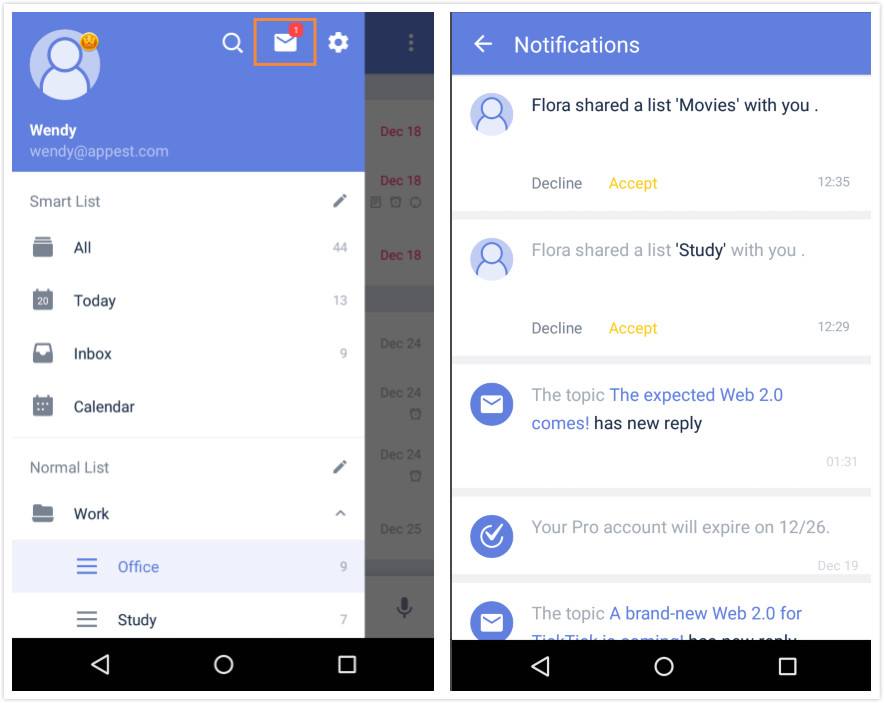

### How to accept a shared list?

If someone shares a list with you, you will receive an invitation to accept the shared list.

1.Open TickTick on your Android device and slide the screen to the right.

2.Tap the mail-shaped icon in the upper right hand of the screen.

3.Choose "Accept", or "Decline" in the next page.

After accepting a shared list, it will be automatically added as a list in your TickTick.

