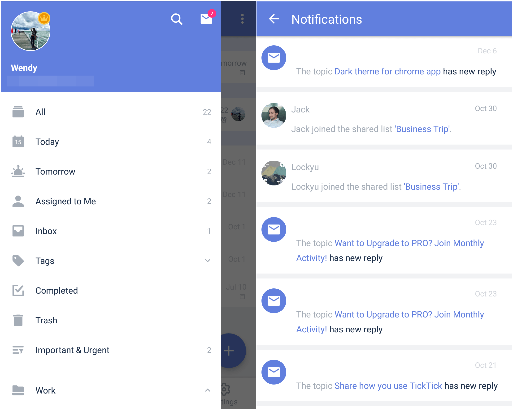

### How to accept a shared list?

If a TickTick user shares a list with you, you will receive an invitation to join the shared list.

1. Open TickTick on your Android device, then either swipe to the right or tap the hamburger button in the upper-left corner.

2. Tap the envelope icon at the top, then tap on the unread invitation.

3. Choose "Accept" or "Decline".

If you accept a list, it will be added to your collection of lists in the sidebar menu.

