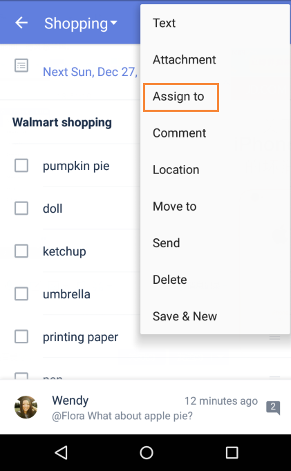

### How to assign a task to someone?
Please note that the person you want to assign a task to must accept your invitation to a shared list before TickTick assigns responsibility for that task to that person.

1. Open TickTick on your android device, then either swipe to the right or tap the hamburger button in the upper-left corner.

2. Tap on a shared list, then tap on the task you wish to assign to someone.

3. Tap the option menu in the upper-right corner, then choose "Assign to".

 

If you want to view all the tasks that are assigned to you, you can enable the predefined list "Assigned to me".