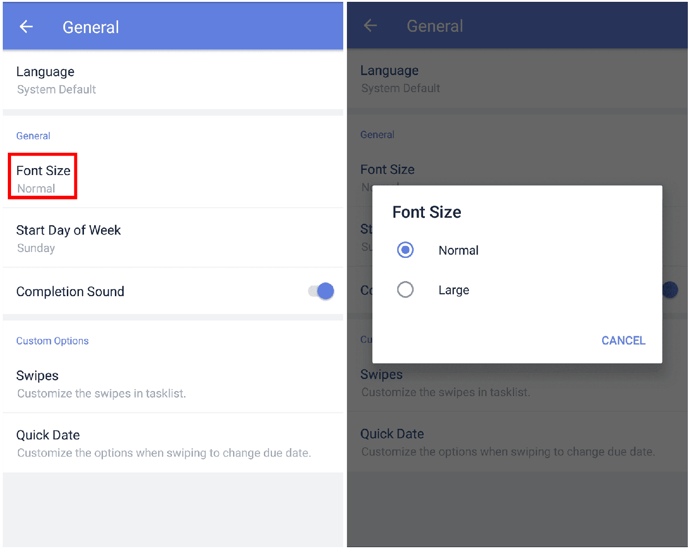

### How to adjust font size?

TickTick has two font sizes: Normal and Large.

1. Open TickTick on your Android device, then either swipe to the right or tap the hamburger button in the upper-left corner.

2. Tap the gear-shaped icon in the upper right corner.

3. Tap "General", then tap "Font size" to select normal or large font size.

