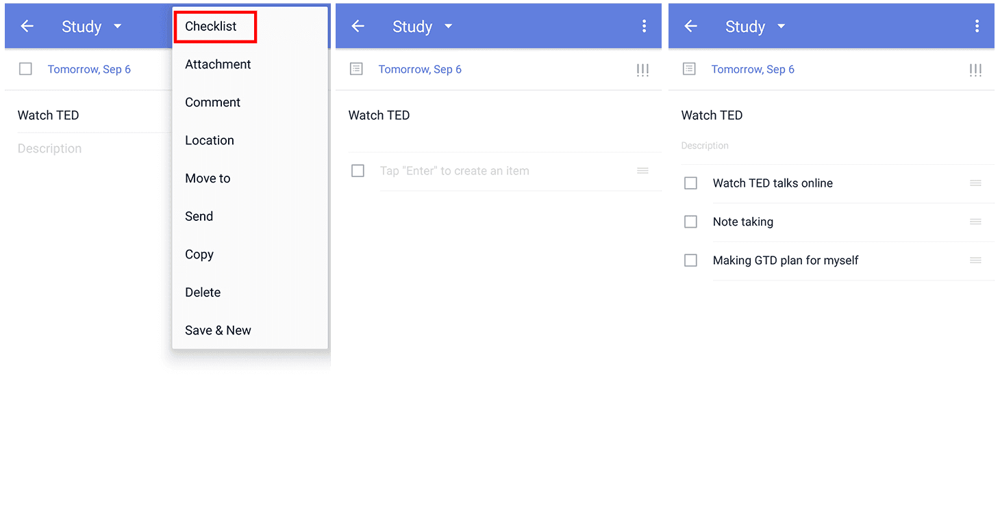
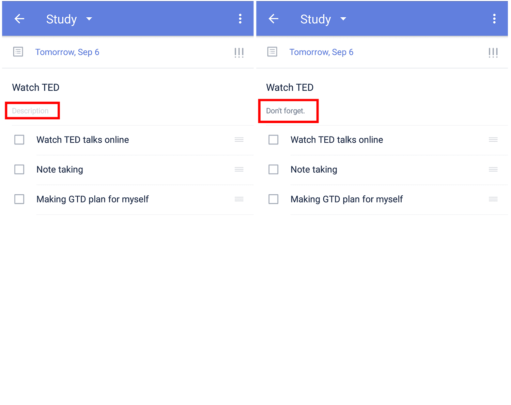

### How to create checklists?

1. Open TickTick on your Android device, and detail page.

2. Tap the option menu in the upper-right corner to select Checklist.

Checklists are useful for tasks requiring verification of completion, like shopping and packing lists. One click on the checklist item marks that item as completed. For example, as you place a grocery item in your grocery basket, you can then mark that item as completed. Individual checklist items cannot be assigned individual due dates, but the entire checklist can have a due date.

### How to add description to a task with checklists?（Premium only\)

If you have a TickTick Premium account, you can add a description to a checklist to add more detail. For example, if you have trouble remembering to ask for a receipt, you could type "don't forget a receipt" into the description line under the name of your shopping checklist.

  

