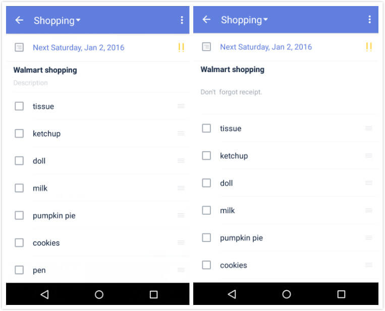

### How to create checklists?
1.Open TickTick on your android device, and enter a task detail page.

2.Tap the option menu in the upper right corner to select Checklist.

Checklist can be used to create a shopping list or packing list. Checklist items are affiliated to tasks and therefore they can’t be assigned due dates individually.

 

###How to add description to a task with checklists?（Pro only）
Enter a task with checklists and tap task title or one of the checklists to be in "edit" mode, then the "Description" field will appear. 
Then you can add necessary description for it.

