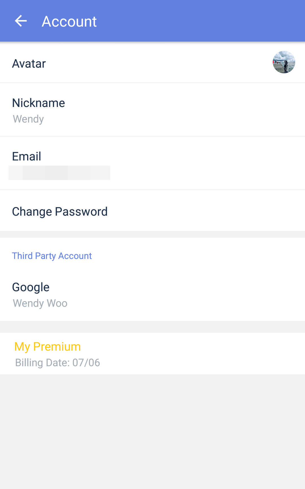

### How to edit my account information?

1. Open TickTick on your Android device, then either swipe to the right or tap the hamburger button in the upper-left corner.

2. Tap your avatar in the upper-left corner to enter account details.

3. You can change your avatar, name, email address, and password here.

