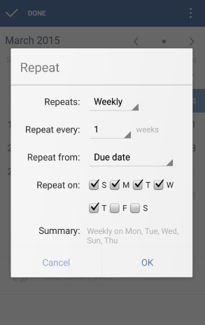

### How to set recurring tasks?
You can set different recurring modes for tasks in TickTick. Once you check off a recurring task, the task will roll to the next recurring date according to the repeating interval. After you enter the setting page of due date, you can tap the “circle” icon to set repetition interval.

If you want to select repeating dates by yourself, you can choose “N days/weeks/months”.

**N days/weeks/months Repeating mode**

|Repeating interval | Mode |
| -- | -- |
|Daily | Every Day |
| Weekly | Repeat every N Weeks Repeat from Due date/Completion date Repeat on S/M/T/W/T/F/S|
| Monthly |  Repeat every N Months Repeat from Due date/Completion date  Repeat by day of the month/day of the week|
| Yearly | Repeat by the day of the year |

**-What is “Repeat from due date/completion date”?**

Here is an example, let's say we have a task which Due date is March 27. However, we complete it on March 28. The task is set by the following repeating mode:

 1.Clear bedroom every month from due date.

2.Clear bedroom every month from completion date.

-1.The next recuring date is April 27.

-2.The next recuring date is April 28.

