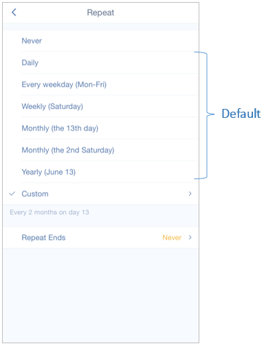

### How to set recurring tasks?
You can set different kinds of recurring tasks in TickTick. Once you check off a recurring task, the task will roll to the next recurring date according to the repeating interval.

 

**-What’s the difference between Defulat repeat mode and Custom repeat mode?**

There are totally two major repeat modes in TickTick: Default and Custom. And Custom can be divided into “Repeat from Due Date” and “Repeat from Completion Date”. To separate these repeat modes, here is an example:

Let's say we have a recurring task which due date is Jun 15, repeating every 2 days, but you didn't check it off until Jun 18.

***1.Default repeat mode: the next recurring date is Jun 19.***

Normally if you check it off on Jun 15 (due date), the next recurring date should be Jun 17, and then June 19, June 21, etc. But if you check it off on Jun 18 which is after its next recurring date Jun 17, the task will directly move to Jun 19. 

***2.Custom repeat mode:***

*1)Repeat from Due Date: the next recurring date is Jun 17.*

No matter when you check off this task, it will roll to the next recurring date, even though the next recurring date has been past.

*2)Repeat from Completion Date: the next recurring date is Jun 20.*

This repeat mode is totally based on your completion date and repeating intervals, regardless of your due date. 

