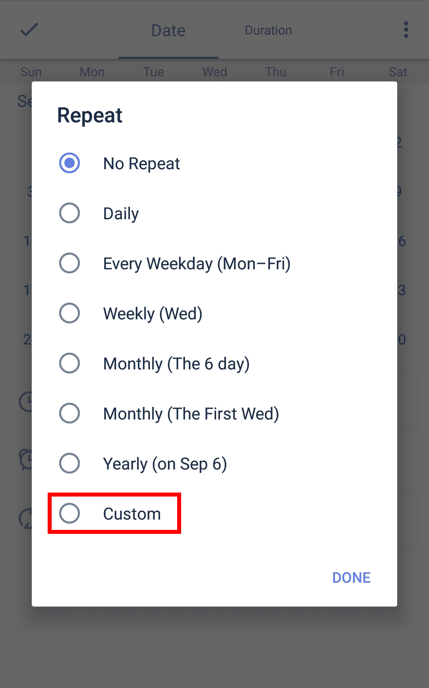

### How to set recurring tasks?
After you check off a recurring task, the task will reappear on the next date set for recurrence. TickTick offers default and custom repeat modes.

 

**What's the difference between Defulat repeat mode and Custom repeat mode?**

Default repeat mode reschedules the repeat task in the future based on the original time interval chosen. Custom repeat mode provides more flexibility and can reschedule in the past. Here is an example:

For example, _a recurring task with a due date of June 15 repeating every 2 days. But you didn't check it off until Jun 18_.

***1.Default repeat mode: the next recurring date is Jun 19.***

In Default repeat mode, if you check the task off on June 15 (the first due date), the next recurring date should be Jun 17 (two days from June 15), and then June 19, June 21, etc. in two-day intervals. But if you check it off on Jun 18 which is after its next recurring date Jun 17, the next scheduled task will be in the future. In this case: Jun 19.

***2.Custom repeat mode:***

*1. Repeat from Due Date: the next recurring date is Jun 17.*

No matter when you check off this task, it will roll to the next recurring date, even though the next recurring date is in the past.

*2. Repeat from Completion Date: the next recurring date is Jun 20.*

This repeat mode is totally based on your completion date and repeating intervals, regardless of your due date. 

