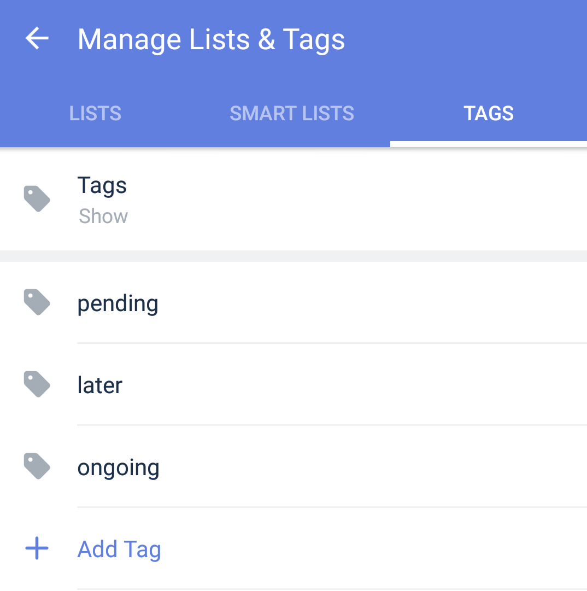

### How to create tags when there's no tasks?

If you already have a complete tagging system sorted in mind, you can start to create tags without tasks. 

How: 
Go to Manage Lists & Tags - Tags - Add tags

For example, you can name your tags as different task status.

- Ongoing
- Pending
- Later
