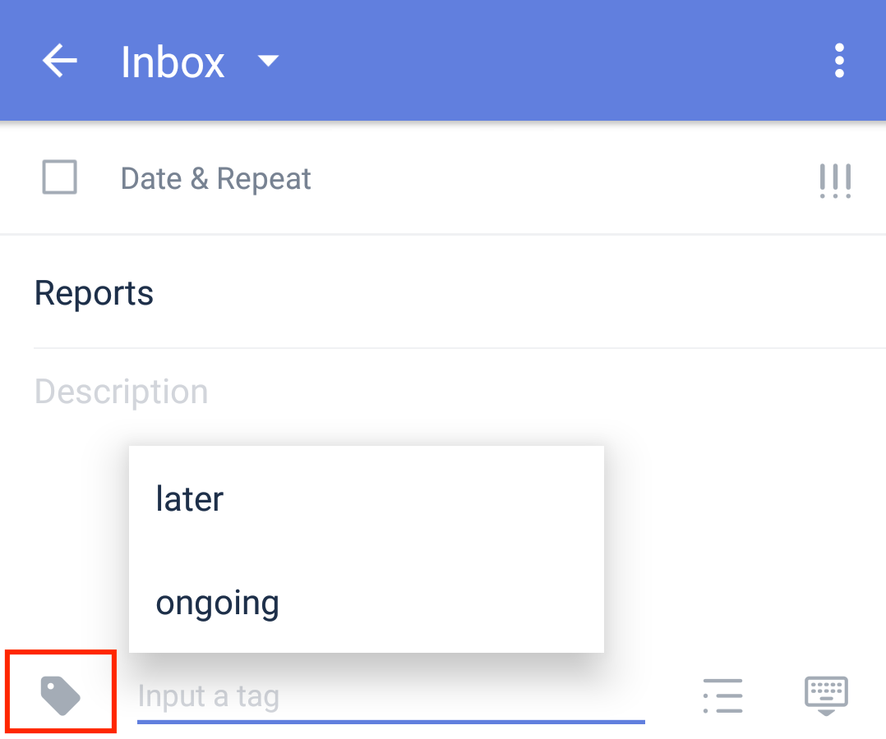

### How to add tags for an existing task?

1. Go into a task’s detail view. You shall see a "Tag" icon locates at the lower left corner. 

2. Simply tap on the icon and start to input a tag name, tap space or enter to save.

If you want to add an existing tag, you can choose from the tag list that appears above the input box after you tap the icon. Have a quick pick without typing the name again.

