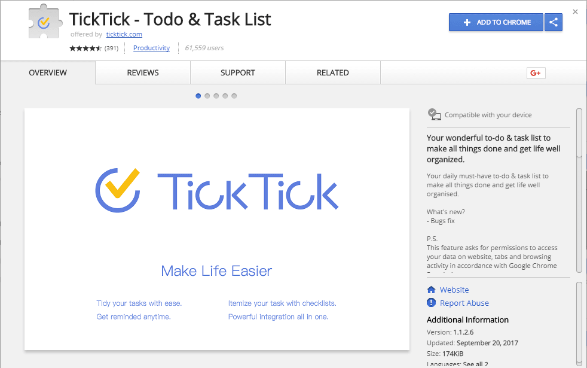

### How can I get the TickTick Chrome Extension?

Visit the Chrome Web Store using Chrome browser and follow the instructions below, or click on this [link](#) and click "Add to Chrome".

1. Search for "TickTick" in the Chrome Web Store search box, then click on the Extension named "TickTick - ToDo & Task List".

2. Click "Add to Chrome".

