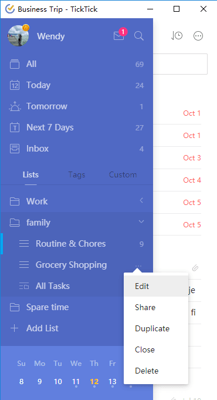

### How to edit a task list?

Click the hamburger button in the top-left corner to switch to the task lists sidebar. Choose a list to edit, then click the icon with the three dots (or numbers) immediately to the right of the list and choose "Edit" from the dropdown menu to change the name, choose a color, choose a folder, or make the list hidden.

