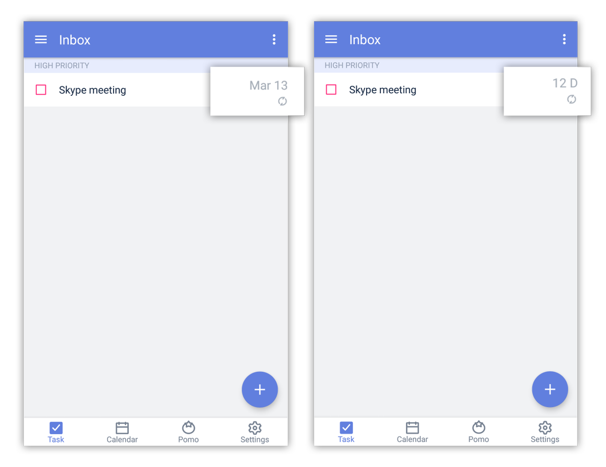

### How to check a task's countdown days?
In a list view, find the task that you want to see its countdown and tap on the due date on the right. A number of how many days left until its due date will then be shown. Tap again to switch back to due date mode.

