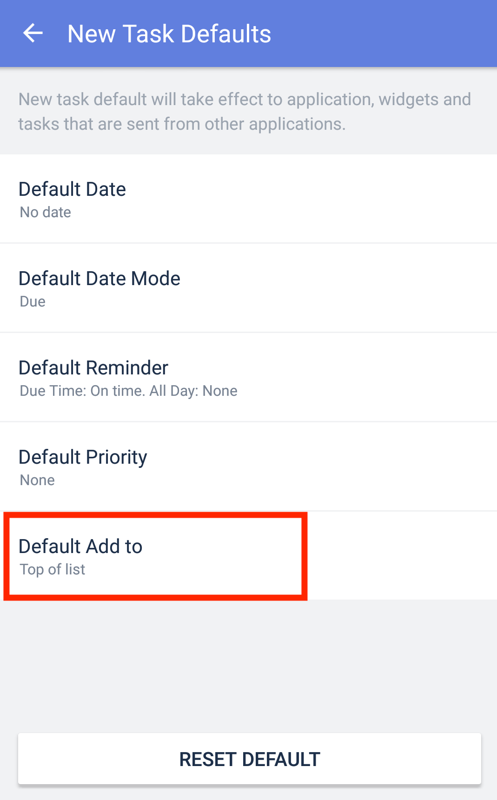

### How to choose to add new tasks to the top or bottom of the list?

1. Go to the Settings tab page, then choose "Advanced Settings".
2. Choose "New Task Default".
3. Select "Default Add to" and make you make your selection.

