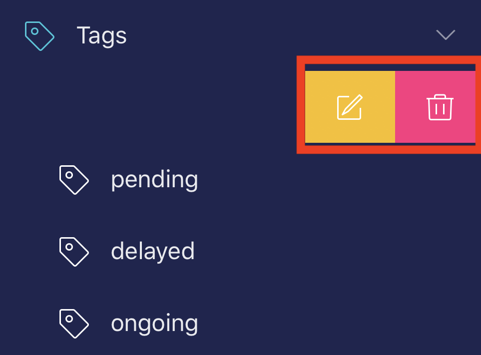
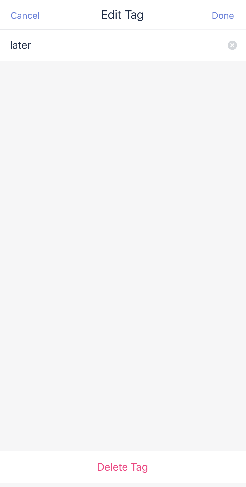

### How to edit / delete existing tags?

Once you have a commonly used tag that’s associated with many tasks, edit the tag name or delete the tag and auto remove it from all tasks would be very useful. In TickTick, you can batch edit tags without going into each task. 

How: 
Find Tags on the left side bar - Left swipe on the tag name that you want to edit - Select the "Edit" icon.

 

Moreover, you can delete a tag and auto remove this tag from all related tasks. 

How: 
Find Tags on the left side bar - Left swipe on the tag name that you want to edit - Select the "Delete" icon.

You can also go to the place where you add tags via Settings - Smart Lists & Tags - Tags, and manage your existing tags there.

