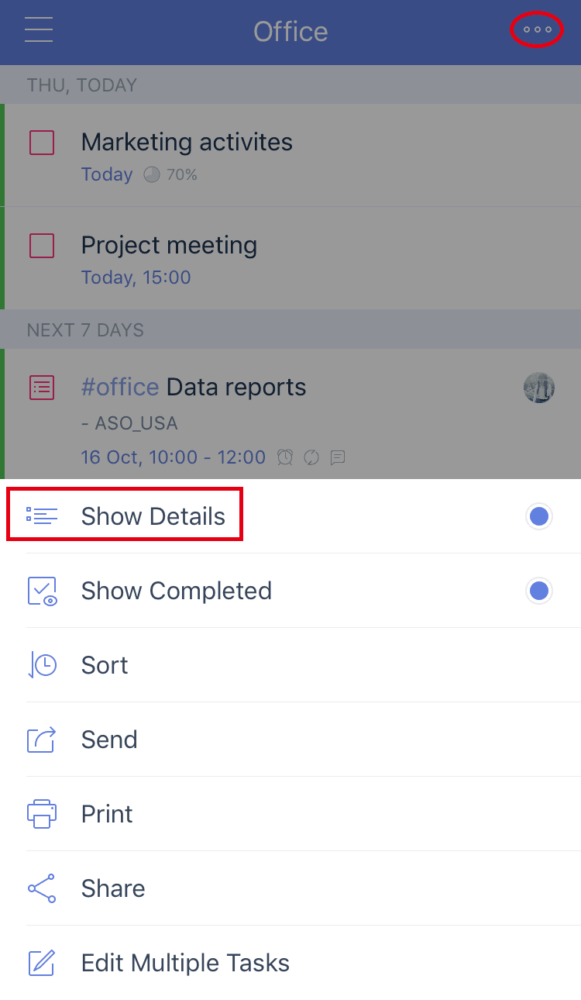

### How to show/hide details?

You can choose to show/hide details in any List view, even in a Tag view too.

1. Click into a list. 

2. Tap "..." icon at the top right hand. 

3. Select to show/hide details.

By allowing to show details, the following information of each task will be shown :

* -Due date, if the task has

* -Tags, if the task has any

* -A alert icon, if the task has a reminder

* -A repeat icon, if the task is set to be repeated

* -An attachment icon, if the task has attachment

* -Its parent list

* -Progress Pie chart indicates the progress of subtasks underneath this task \(not shown if none of the subtasks has been done yet\)

* -the FIRST subtask ONLY.

**    
**

**    
**

**Note: This feature is not available on the web.**

