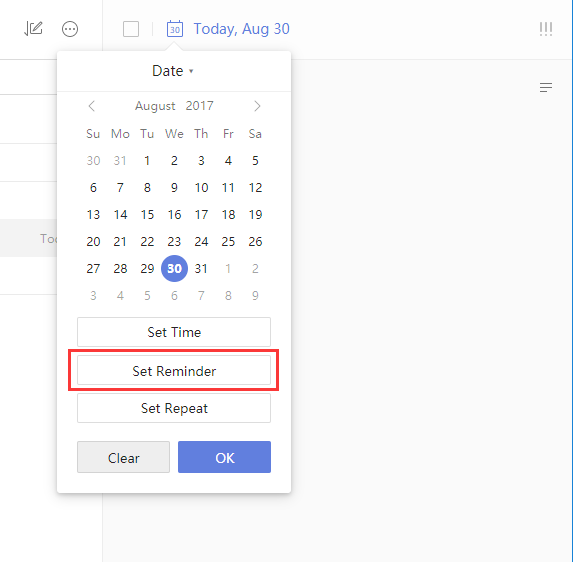

### How to add reminders ?

1. Sign in to TickTick on the web

2. Click the task's due date in the upper-left corner of the right panel.

3. Click time below the calendar to add a reminder time.

If you want to add more than one reminder to a task, click "On time". Then you can add reminders \(for example, "5 minutes before","1 hour before","1 day before", etc. or "custom" set\). Users of free TickTick accounts may add up to two reminders per task. Premium users are allowed a maximum of five reminders per task.

