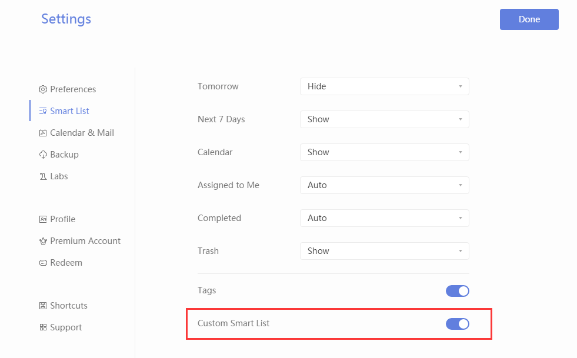
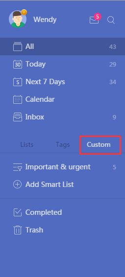

# How to create Custom Smart List? \(Pro\)

In order to create Custom Smart Lists on web, you should first enable "Custom Smart List" by: Settings, Smart List, Custom Smart List \(enable\).

After "Custom Smart List" is enabled, you can click "Custom" in Left side bar to add Custom Smart List.

The created Custom Smart List will show in "Custom" section in left side bar.

