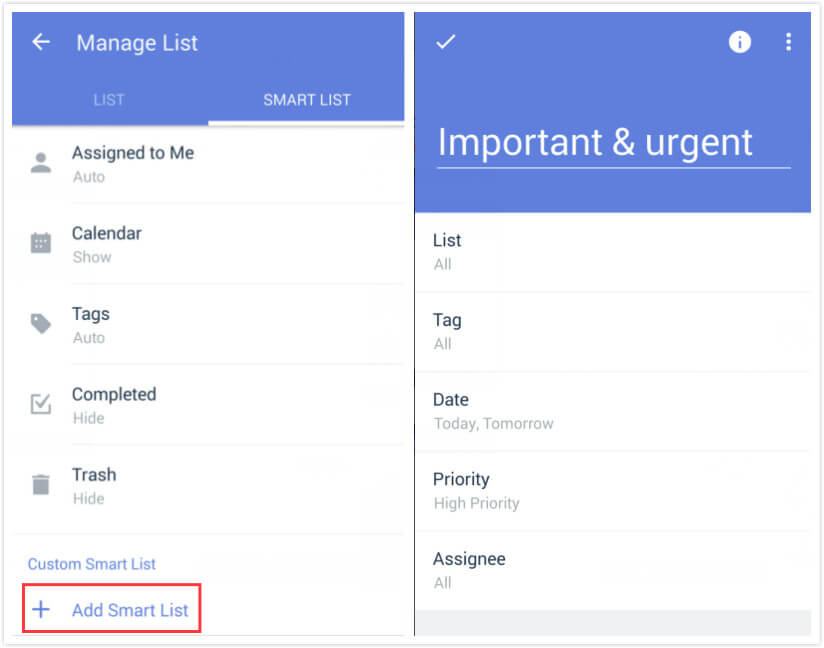
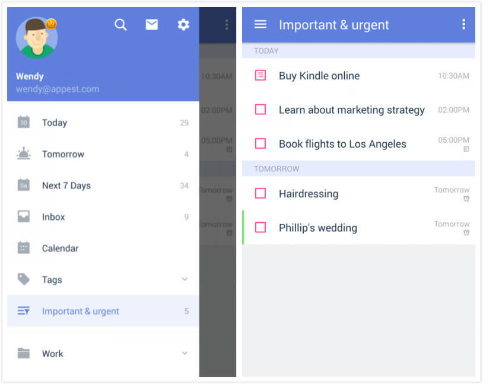
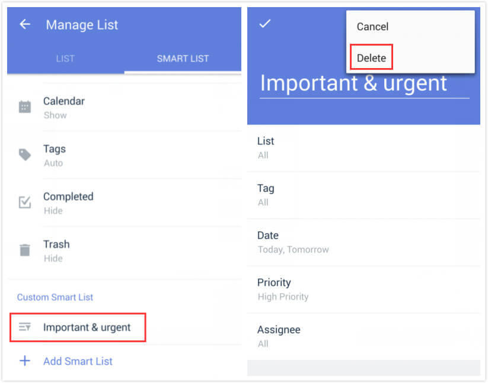

# How to create Custom Smart List?

### To create your own Smart List:

1. Scroll down the left bar and choose "Manage List".
2. Tap "Smart List".
3. Tap "Add Smart List" at the bottom of the screen.

There are 5 filter criteria provided: List, Tag, Date, Priority, Assignee. These Filters are flexible enough to help you generate your own Smart List.

Imagine that you need to focus on only important and urgent schedules, just choose “High priority” and “Today”, “Tomorrow” in Filters to create a custom smart list: Important & urgent.

### To delete a Custom Smart List:

1. Scroll down the left bar and choose "Manage List".
2. Tap "Smart List".
3. Tap the Custom Smart List you want to delete.
4. Tap the option menu in the upper right hand corner of the screen and choose "Delete".

