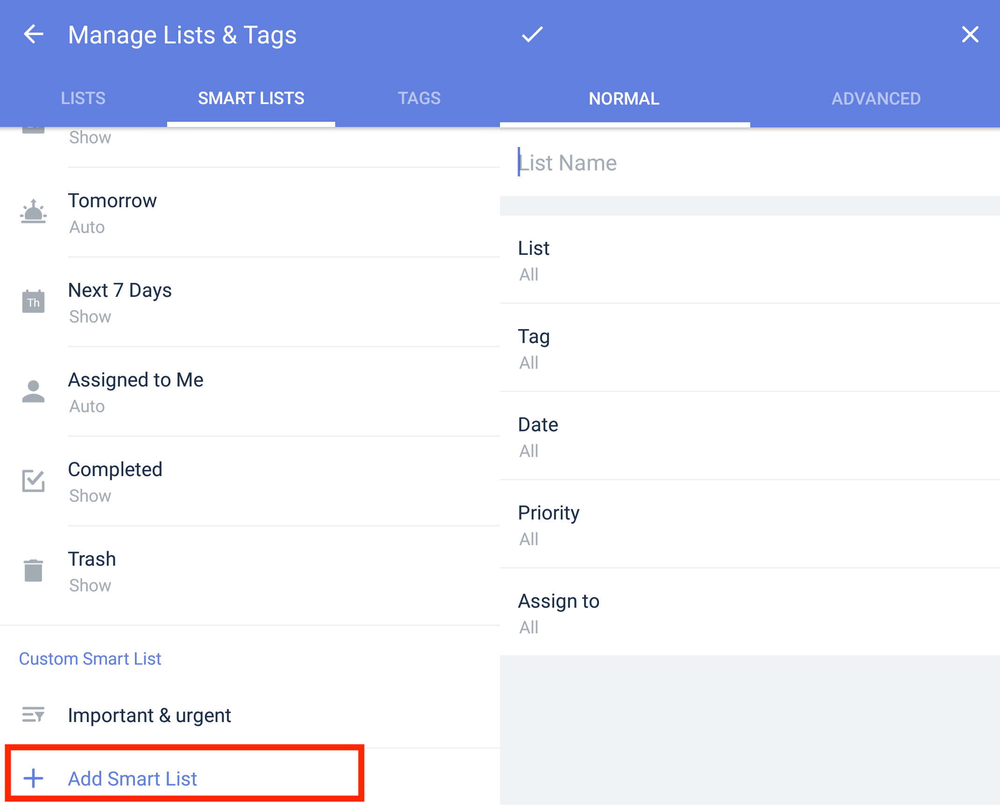

### How to create a Custom Smart List?(Premium)

1. Open TickTick on your Android device

2. Tap "Manage Lists & Tags" at the bottom of the leftside list menu.

3. Tap "Smart Lists" in the upper-right corner.

4. Tap "Add Smart Lists"

