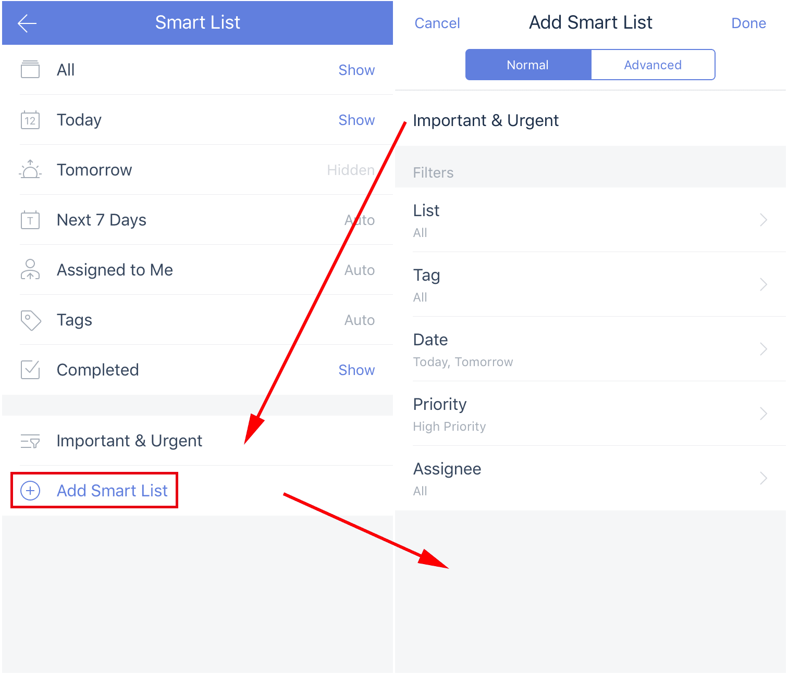
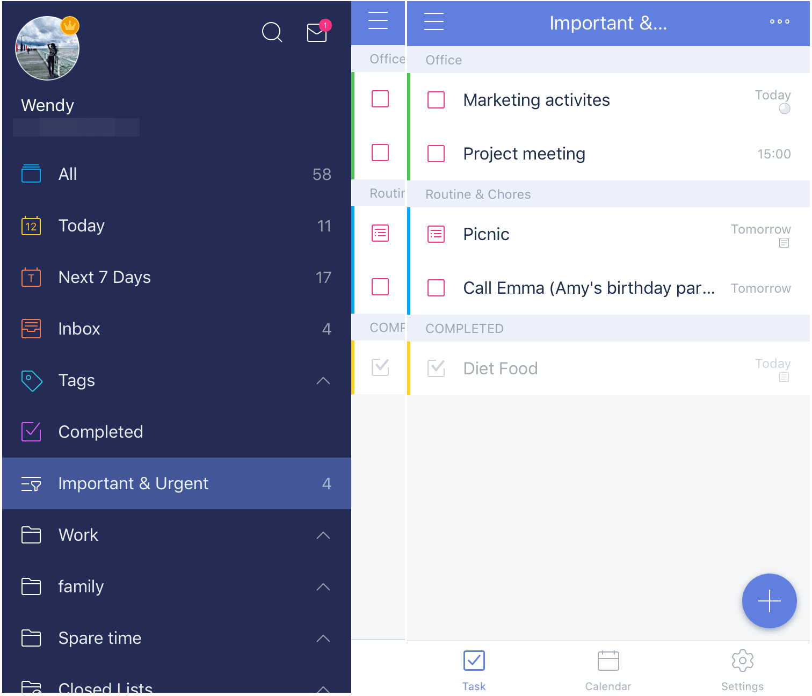
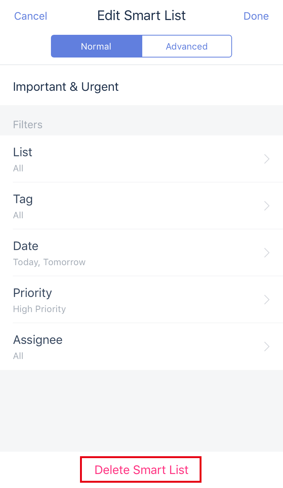

### How to create a Custom Smart List? (Premium)

1. Go to Settings page from the tab bar.

2. Tap "Smart List".
 
3. Tap "Add Smart List" at the bottom of the screen, then tap "Advanced" to add a custom Smart List.

You can sort items by List, Tag, Date, Priority, Assignee. These Filters are flexible enough to help you generate your own Smart List.

If you need to focus on only items you marked with high priority in TickTick, just choose "High priority", "Today", and "Tomorrow" in the Smart List filters menu to create a custom smart list which you can name "High Priority" or some similar name.

### Delete a Custom Smart List:

1. Go to Settings page from the tab bar.

2. Tap "Smart List".

3. Select the Custom Smart List you want to delete.

4. Tap "Delete Smart List" at the bottom of the screen.

