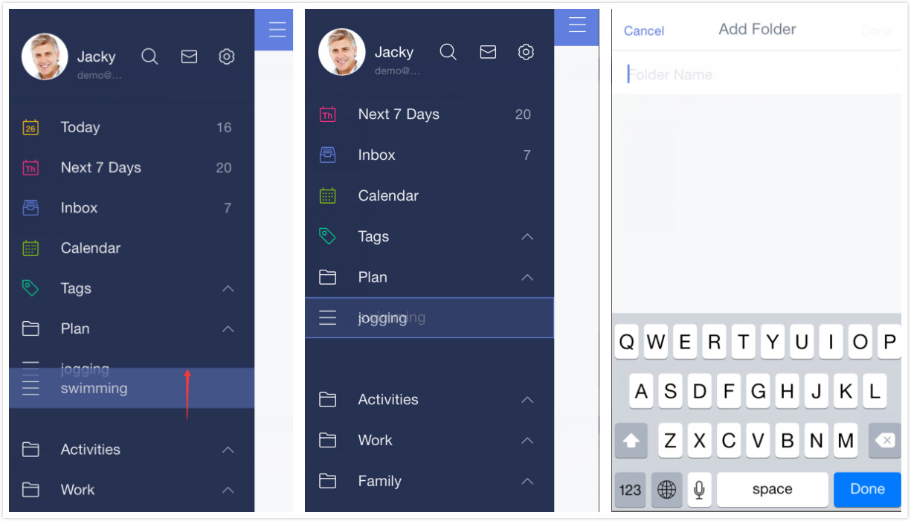

###How to create list folders?

With Folders, organizing your lists is as simple as drag-and-drop. 

1.Open TickTick on your iOS device.

2.Drag a list on top of another that you’d like to include in the same folder.

3.Hover your selected list until a blue box appears around the second list. 

4.Drop the selected list, and then you can enter a name for the folder.

