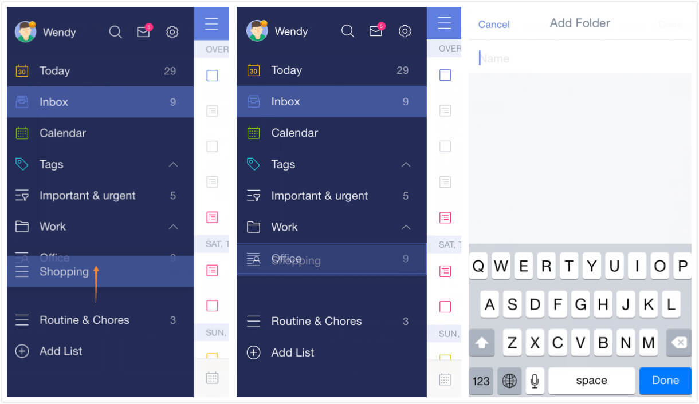

### How to create folders for lists?

Folders make organizing your lists as simple as drag-and-drop.

1. Open TickTick on your iOS device and slide the screen to the right.

2. Press a list and drag it on top of another list that you want to include in the same folder.

3. Continue to press on your selected list until a blue box appears around the other list, then drop the selected list.

4. Enter a name for the new folder.

