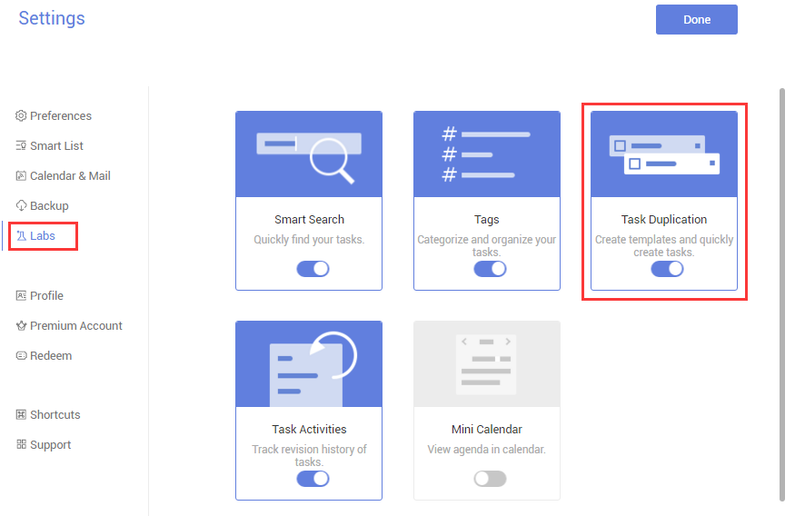
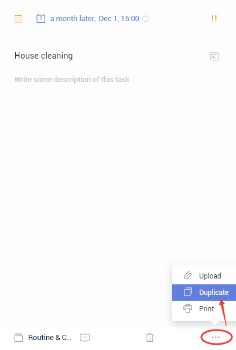

### How to duplicate tasks?

1.Sign in TickTick on web.

2.Click avatar in the upper-left hand corner of the page to select “Settings”.

3.Enable Task Duplication in “Labs”.

4.Select a task.

5.Click “···” in the bottom right corner of the page to select “Duplicate”.

After that a copy will be generated.

