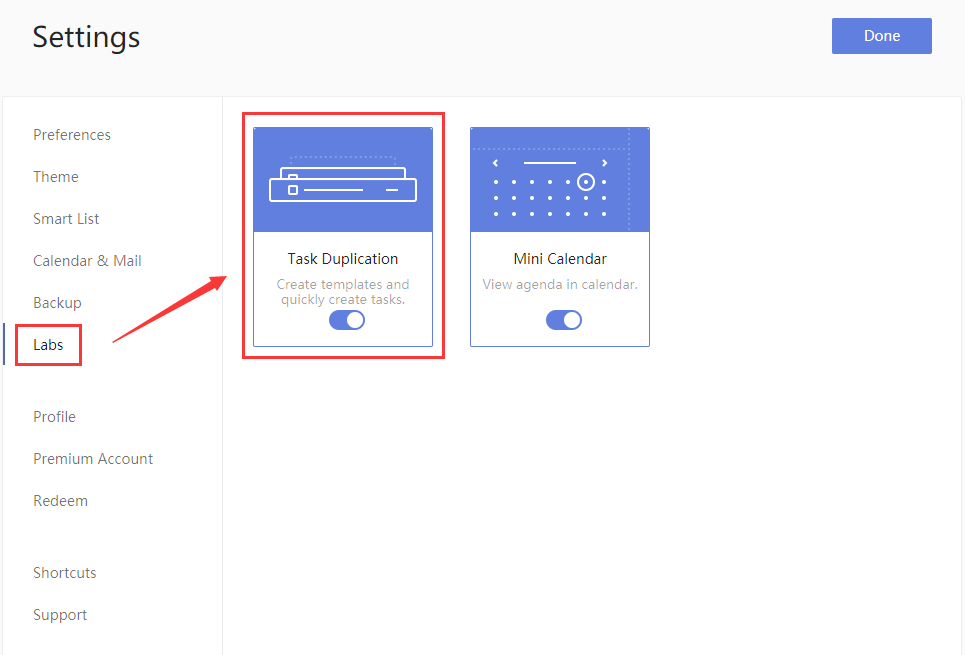
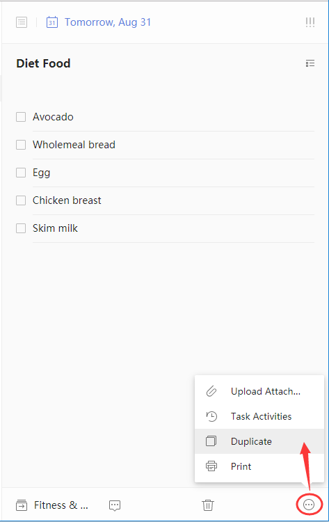

### How to duplicate tasks?

1. Sign in to TickTick on the web.

2. Click the avatar in the upper-left corner of your TickTick homepage, then click "Settings" from the menu that appears.3.

3. Click "Labs", then enable "Task Duplication".

4. Click "Done" and exit the settings so you can choose a task to duplicate.

5. Click "···" in the bottom-right corner of the list view page to choose "Duplicate" and a duplicate entry will be entered marked with the word "copy".

Change the date and time of the duplicate as appropriate.

