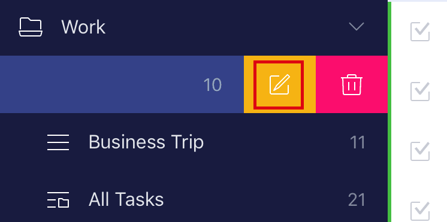

### How to edit lists and folders?

1. Open TickTick on your iOS device and slide the screen to the right at the Task tab.

2. Swipe a list or folder to the left.

3. Tap "Edit"to edit the list or folder.

