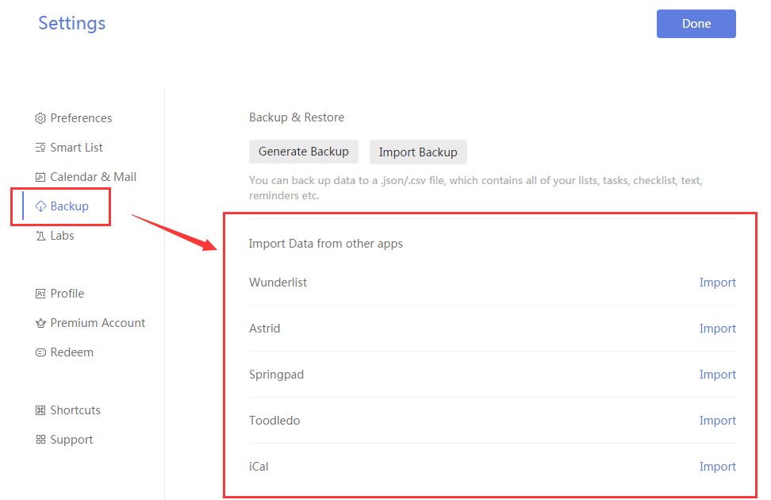

### How to import tasks from other apps to TickTick?

1. Sign in to TickTick on the web.

2. Click the avatar in the upper-left corner of your TickTick homepage, then click "Settings" from the menu that appears.

3. Click “Backup” in the left panel.

TickTick allows you to import tasks from other to-do apps, including Wunderlist, Omnifocus, Astrid, Toodledo, Springpad, and iCal.

