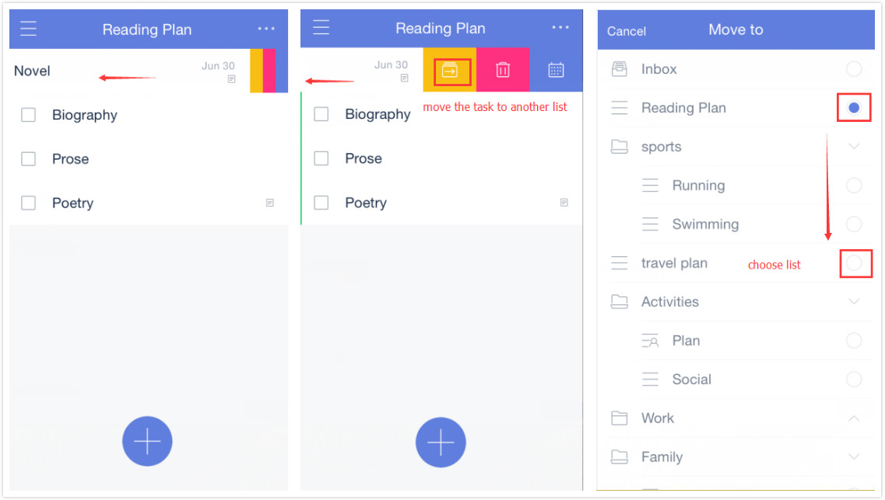

### How to move a task from one list to another?

Option 1:

1.Open TickTick on your iOS device and select a task to enter task detail screen.

2.Tap the current list name in middle of top bar.

3.Then a lists screen will show for you to choose a list you want to move the task into.Tap the new list name to finish moving.

Option 2(Quick action):

1.Swipe a task to the left, and then three icons with different background color will appear. They are respectively used to: move task from one list to another, delete the task, and change due date. 

2.Tap the first icon with yellow background color. 

3.Choose a new list to finish moving.

