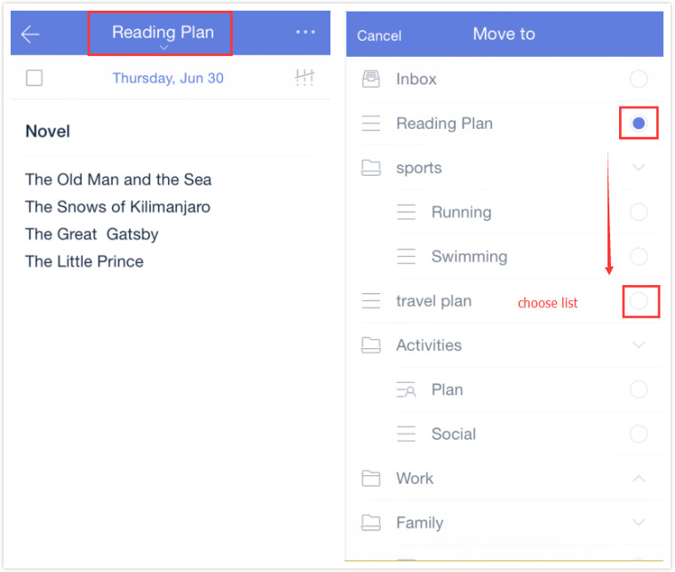

### How to move a task from one list to another?

1.Open TickTick on your iOS device and select a task.

2.Tap the option menu in the upper right hand corner of the page.

3.Tap “Move to” to choose a new list for the task.

