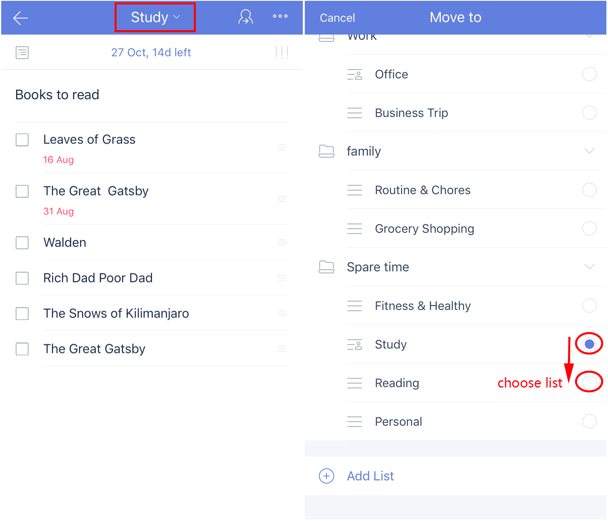
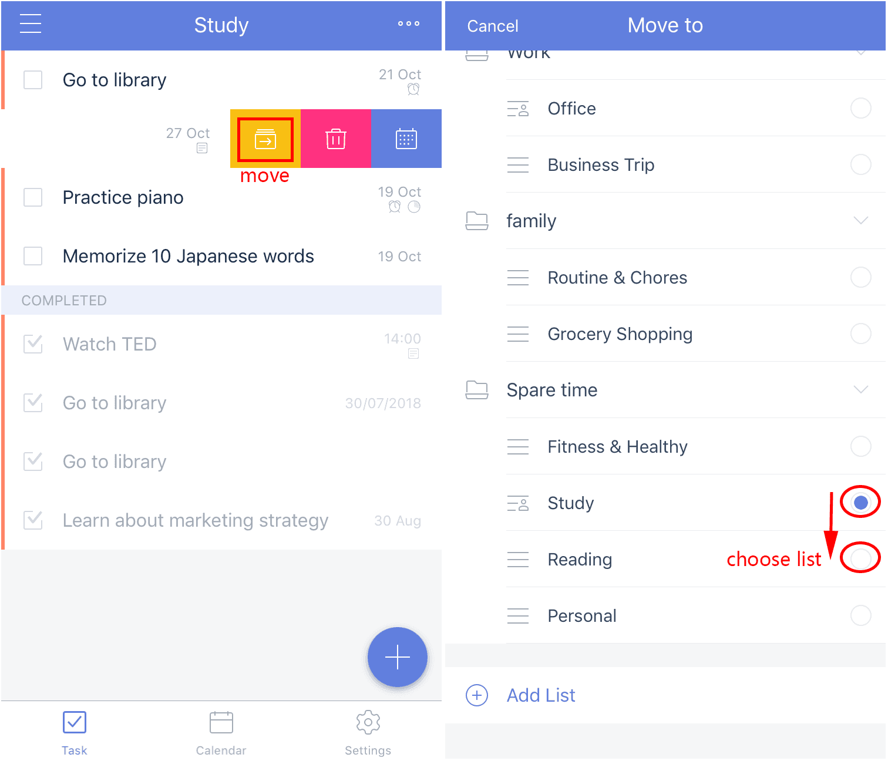

### How to move a task from one list to another?

##### Option 1:

1. Open TickTick on your iOS device and select a task to enter task detail screen.

2. Tap the current list name in middle of top bar, then a "Move to" screen will appear.

3. Tap a list you want the task to be moved into.

##### Option 2\(Quick action swipe\):

1. Swipe a task to the left, and then three icons with different background color will appear. Then tap the first icon with the yellow background color.

2. Tap on a list you want to move the task into.

Note that the red and blue quick action swipe features are discussed in section 4.3.9.!

