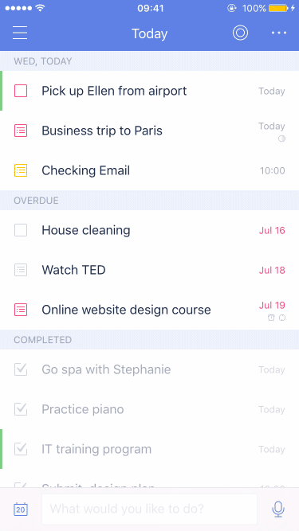

# How to record task progress?

### To record progress for a task:

1. Tap a task title to enter the task's detail page.

2. Press on the date section of the screen to bring up a shaded progress bar which you can slide from 0% to 100% to easily record what you think the level of progress on that task is.

Note, if the task contains a checklist, progress will be automatically recorded based on the percentage of items marked completed. For example, a checklist with 2 items unchecked and 1 item checked off as completed will show 33% progress.

