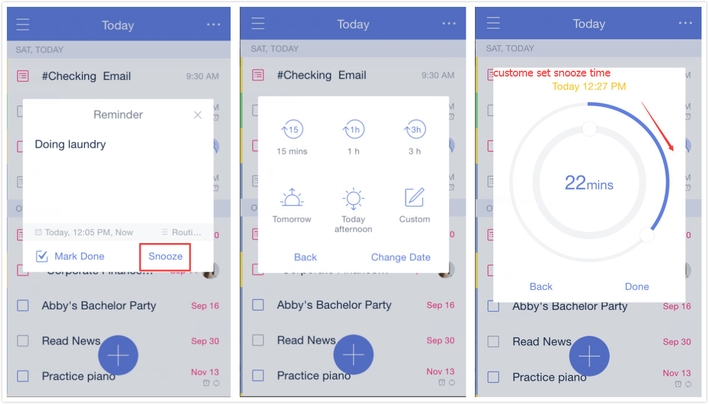

###How to set snooze time?###

When getting a reminder on your iOS device, you can set snooze time to let it ring again later. Tap the task in the pull-down screen to select an existing snooze time. You can also tap “Custom” to set snooze time by yourself, or even choose another date. 

