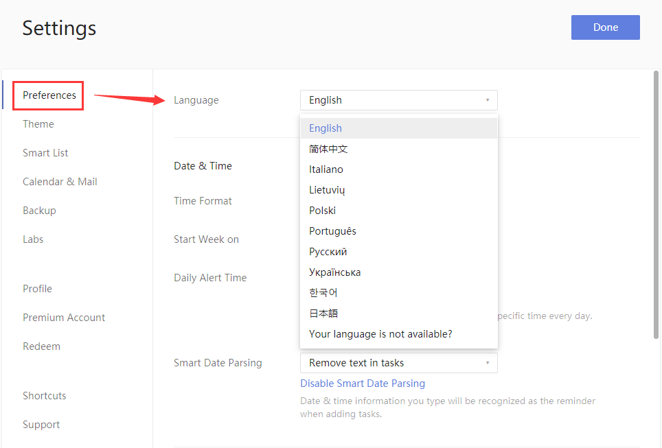

### How to set TickTick's language

1. Sign in to TickTick on the web.

2. Click the avatar in the upper-left corner of your TickTick homepage, then click "Settings" from the menu that appears.

3. Choose a language in the "Language" option on the right panel.

**P.S.** If your language does not appear in the list, and you want to help us do translation work in your language, clicking "Your language is not available?" at the bottom of the drop-down menu. This opens a new tab where you can click "Help us translate" to complete a form. Upon submission of the form, we will contact you soon.

