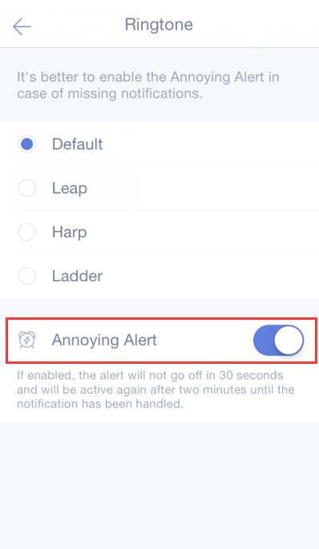

### How to set reminder ringtone and annoying alert?

#### Set ringtone for reminders?

1. Open TickTick on your iOS device and slide the screen to the right.

2. Tap the gear-shaped icon in the upper-right hand corner of the page.

3. Tap "Preferences", then tap "Ringtone", then select from one of the available ringtones. When you make a selection, the ringtone will sound so you can hear what it sounds like.

#### Annoying alert?

If "annoying alert" is enabled, the alert will not go off in 30 seconds and will be active again after two minutes until the notification has been handled.

1. Open TickTick on your iOS device and slide the screen to the right.

2. Tap the gear-shaped icon in the upper-right corner.

3. Tap "Preferences", then tap "Ringtone", then tap the "Annoying Alert" toggle button to enable it.

