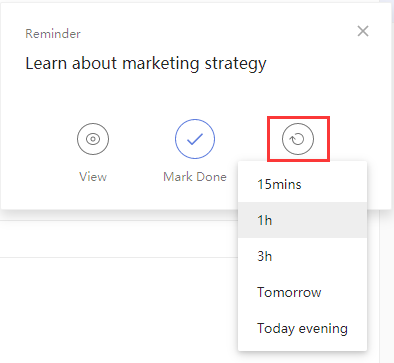

### How to set snooze time?

When you get a pop-up reminder with TickTick on the web , you can click snooze to have the reminder ring again at a short time later. Click snooze to select an existing snooze time, or click "Custom" to set it by yourself, or even choose another date.

