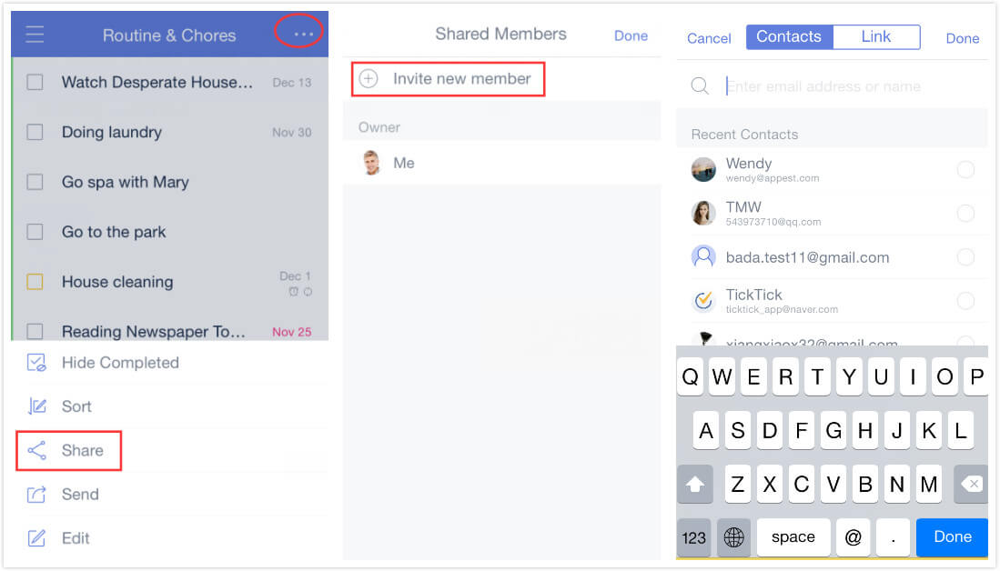
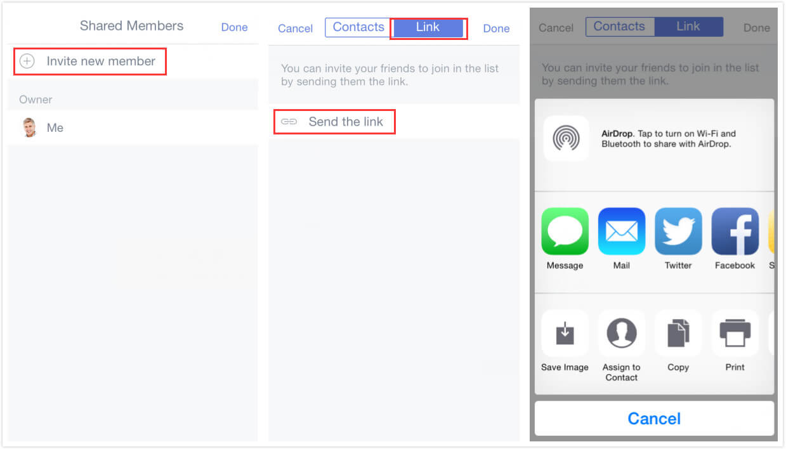

# How to share task lists?

With a shared list, it is easy to check a shopping list with your family members or discuss a meeting agenda with your colleagues.

### Option 1: Share via Email

1. Open TickTick on your iOS device and slide the screen to the right.

2. Tap on a list you want to share, then tap the option menu in the upper-right corner, then tap "Share".

3. Tap "Invite Member".

4. Enter your contact's email address, then tap "Done".

### Option 2: Share via link

1. Open TickTick on your iOS device and slide the screen to the right.

2. Tap on a list you want to share, then tap the option menu in the upper-right corner, then tap "Share".

3. Tap "Invite Member".

4. Tap "Link" beside "Contacts", then tap "Send the link".

5. Select an app to share the link with others. Other options include "Assign to Contact", "Copy", and "Print".

If your invitees follow the link, TickTick will send a notification to you asking whether you want to share the list with them. If you agree, the list will be shared and copied to their TickTick accounts automatically.

