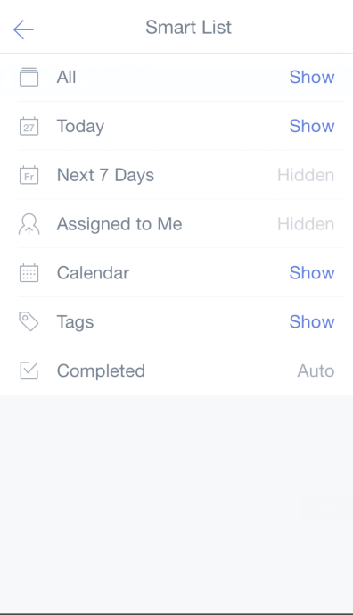

# How to show/hide Smart Lists ?

There are 7 default lists in TickTick: All, Today, Next 7 Days, Assigned to me, Calendar, Tags, Completed. Some of them are hidden by default, and you can enable them by the following steps:

Take "Completed" as an example:

1. Open TickTick on your iOS device and slide the screen to the right.

2. Click the gear-shaped icon in the upper right corner.

3. Tap "Smart List".

4. Enable "Completed"\(choose "show"\).

