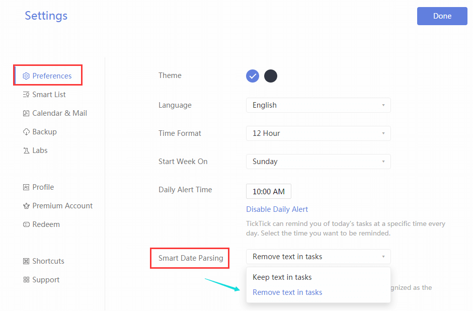

# How to use Smart Date Parsing when adding tasks?

Date & time information you type will be recognized as dua date and reminder when adding tasks.

For example, if you want to go to library on July 30 at 2 pm, you just need to type: “Go to library July 30 2 pm”, then TickTick will automatically recognize July 30 as the task’s due date and set 2 pm as its reminder. 

###How to remove date & time info from task content when using Smart Date Parsing?

If you prefer date and time not showing in your task content after task is created, you can set it in Settings, Advanced Settings, Smart Date Parsing, Remove Text in Tasks.

