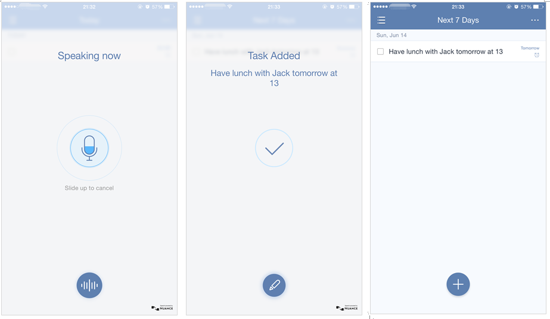

### How to create a new task?

<iframe width="700" height="400" src="https://www.youtube.com/embed/7TWvercsVvA?list=PLbWRKVi0_aTEwRLCS5T4MD0wCQU_ve8xW" frameborder="0" allowfullscreen></iframe>

 

**-Option 1: Add Button**

Open TickTick on mobile and choose a list first, and then tap “+” at the bottom of the task page to enter a new task. 

 

**-Option 2: Pull-down Screen **

1.Pull down the screen.

2.In the “Today” section, tap “Add New” if you have already added TickTick in “Today”.

*If TickTick is not in “Today” section, you should add it first by tapping “Edit” at the bottom of pull-down screen. 

 

**-Option 3: Voice Input**

1.Open TickTick on mobile and long press “+” at the bottom of the task page.

2.Start speaking. You can say, for example, “Have lunch with Jack tomorrow at 13”.

A new task will be added with due date (tomorrow) and reminder time (13). 

If you find TickTick can’t recognize what you speak, you should check “Voice typing langugae” first. Turn to 3.1.12 for more details.

