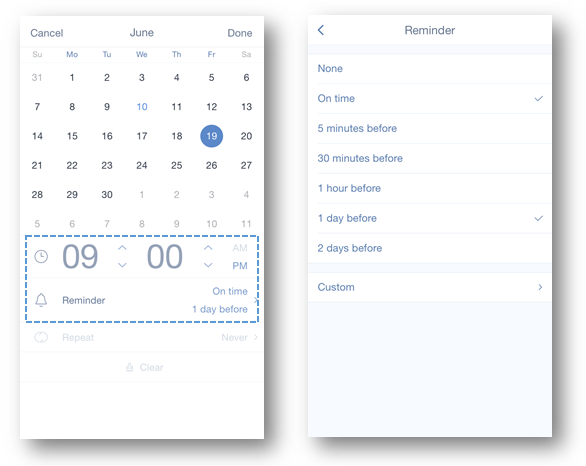

###  How to set reminder for a task?
In TickTick you can set reminders for any tasks. To add a reminder:

1.Open TickTick on your iOS device and select a task.

2.Tap its due date in middle of top bar.

3.Set a reminder time below calendar.

To add more reminders, you can tap “Reminder” to add reminders such as “5 min before”, “1 day before”, etc. Free users are allowed to add 2 reminders, while Pro users can have at most 5 reminders. 

