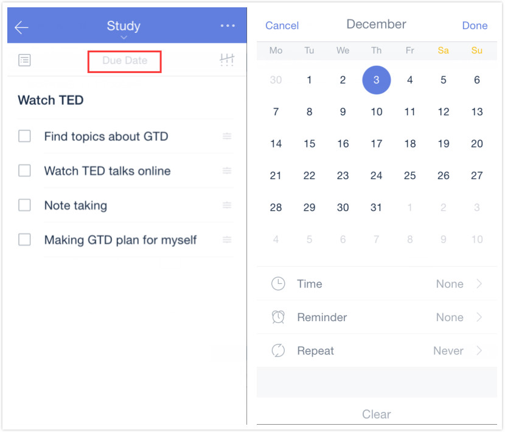
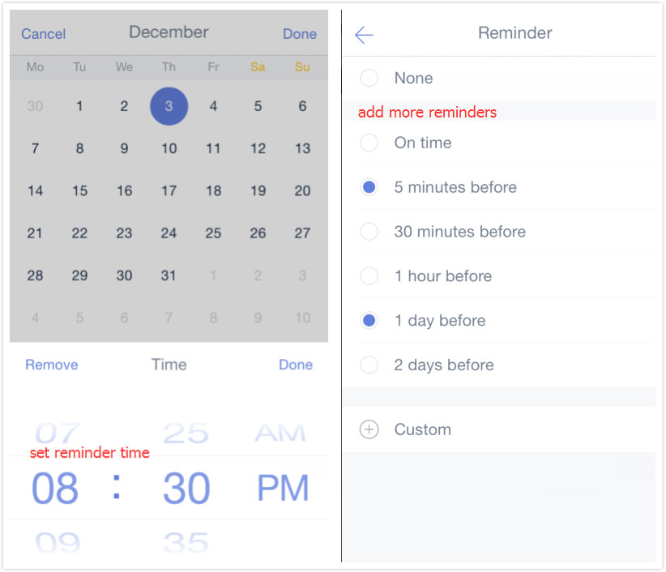

###  How to set due date and reminders for a task?
In TickTick you can set reminders for any tasks. To add a reminder:

1.Open TickTick on your iOS device and select a task.

2.Tap "due date" in task detail page.

3.Choose a day in calendar to set due date for the task.

3.Tap "Time" below calendar to set reminder time.

4.To add more reminders, you can tap “Reminder” to add reminders such as “5 minutes before”, “1 day before”, or you can choose "custom" to set reminders you like. Free users are allowed to add 2 reminders, while Pro users can have at most 5 reminders. 

